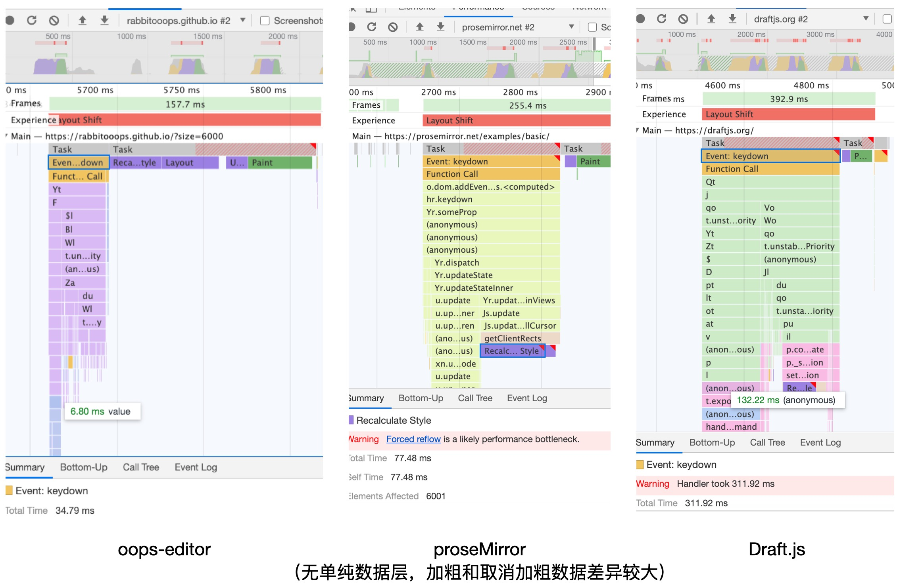
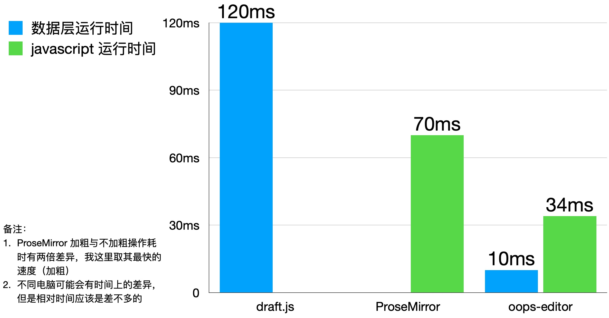

这个编辑器架构原形是我花费自己的几个周末的休息时间写的。我需要尽可能快地证明这个idea是可行的，而不是被一些细枝末节所阻塞。

总的来说，这个编辑器之所以快的原因在于使用了访问者模式（我是写完这个编辑器之后学了一下 babel 原理才发现我的编辑器居然和 babel 的实现方式很相似，即使用了访问者模式😓😂）。

更新流程：
1. 来自视图层的原生事件触发
2. controller将原生事件转化为用户意图（这个地方比较有趣，我现在的实现拓展性是不足的，我想到一种很好的方法😄），开始在数据层某个节点处发起事件
3. 遍历所有节点，调用节点的hook，通过hook对节点本身进行数据更新
4. 更新数据时调用render函数，触发视图层的更新操作

数据层性能的测试方法：目的是故意执行些高耗能的操作，所以初始化6000个节点，全选(command(ctrl) + a)再对其进行加粗（command(ctrl) + b）操作即可。对比其他编辑器的方法是构造出6000个节点，如正常字体与下划线间隔构造（如：abc<ins>abc</ins>abc<ins>abc</ins>），再全选加粗。

需要指出的是依然有很多可以改进的空间（我知道要改进的方向，因为目前架构的能力还是会有欠缺），但是设计方向是对的，从性能以及我确实实现了这个编辑器可以证明这一点。

还有的是，假如实现协同能力和排版引擎，依然需要做很多的相关研究和设计。但其实无协同，无排版引擎（专业级别的编辑器需要排版引擎的根本原因在于html+css无法满足高度自定义的文字排版需求）已经能满足绝大部分的需求，基于这个架构去做应该是没问题的（编辑器的选区难点其实是可以解决的，参考腾讯文档或Google docs的做法即可），因为假如实现这两个能力，已经是可以匹敌Google Docs的商业级产品了，需要投入很多人力很多时间去做这件事情。

## 性能表现

欢迎测试！其他开源编辑器的性能都太差了（闭源的比如谷歌文档、腾讯文档倒是很快），所以只取这两个开源编辑器进行比较。

